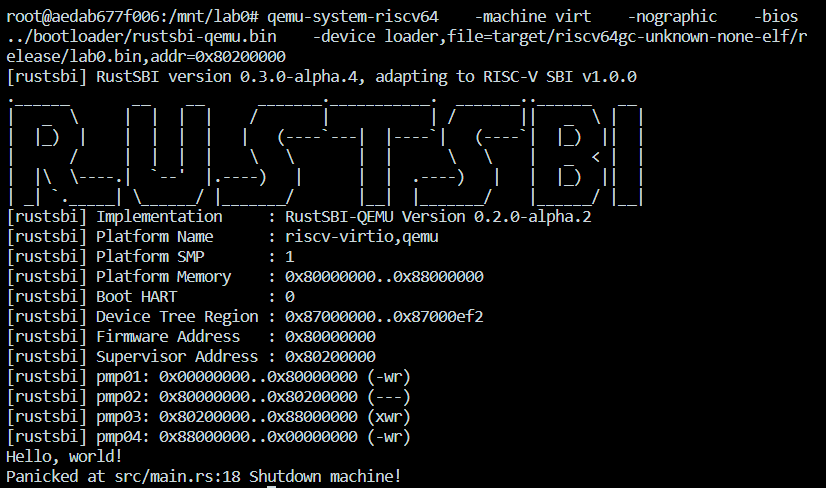

# Lab0 - 内核的第一条指令

目录结构如下图所示（rustsbi-qemu.bin 不在此仓库中，需要额外配置）

```
..
├── lab0
│   ├── .cargo
│   ├── src
│   ├── Cargo.toml
│   └── README.md
└── bootloader
    └── rustsbi-qemu.bin
```

运行结果如下图所示：


2022/10/29